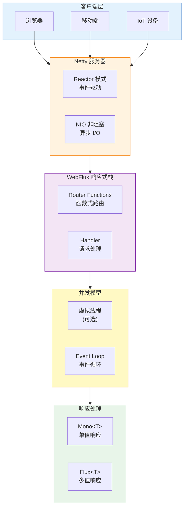

# test-highlyConcurrent

Spring Boot 高并发演示项目

## 项目简介

本项目演示 Spring Boot 3 中的高并发处理能力，使用 WebFlux 响应式编程和 Netty 作为嵌入式服务器来提升并发性能。

## 系统架构图



## 技术栈

| 技术 | 版本 | 说明 |
|------|------|------|
| Java | 25 | 编程语言 |
| Spring Boot | 3.4.5 | 基础框架 |
| Spring WebFlux | 3.4.5 | 响应式 Web 框架 |
| Netty | (内置) | 高性能网络框架 |
| Lombok | 1.18.46 | 工具库 |

## 核心特性

- **响应式编程**: 使用 Mono/Flux 进行非阻塞编程
- **Netty 服务器**: 内置 Netty 提供高性能 I/O
- **背压支持**: 内置背压机制，防止系统过载
- **高并发**: 单机支持数十万并发连接

## 快速开始

### 1. 环境要求

- JDK 25+
- Maven 3.6+

### 2. 编译运行

```bash
mvn clean compile
mvn spring-boot:run
```

### 3. 测试高并发

使用压测工具测试并发性能：

```bash
ab -n 100000 -c 1000 http://localhost:8080/api/concurrent
```

## 项目结构

```
test-highlyConcurrent/
├── src/main/java/wo1261931780/
│   ├── controller/          # 控制器层
│   │   └── ConcurrencyController.java
│   ├── service/           # 服务层
│   └── TestHighlyConcurrentApplication.java
├── src/main/resources/
│   └── application.yml     # 配置文件
├── pom.xml                # Maven 配置
└── README.md
```

## 响应式编程示例

```java
@GetMapping("/concurrent")
public Mono<Response> concurrent() {
    return Mono.just(Response.ok("High Concurrency"));
}

@GetMapping("/stream")
public Flux<Response> stream() {
    return Flux.interval(Duration.ofSeconds(1))
        .map(i -> Response.ok("Message " + i));
}
```

## 性能对比

| 指标 | 传统阻塞 | WebFlux 响应式 |
|------|----------|----------------|
| 线程模型 | 一线程一请求 | 事件驱动 |
| 内存占用 | 高 | 低 |
| 吞吐量 | 中 | 高 |
| 背压支持 | 无 | 有 |

## License

MIT