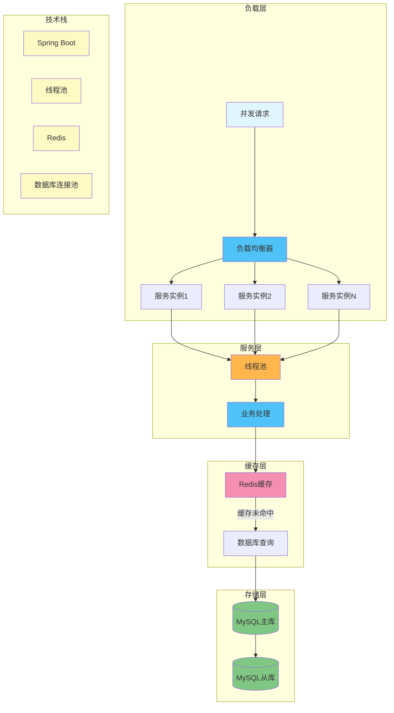
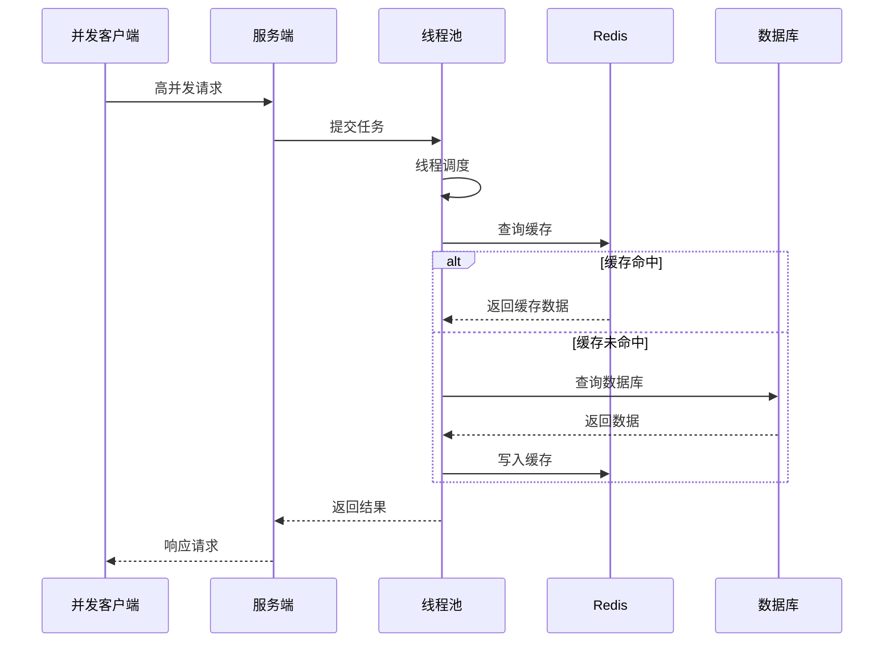
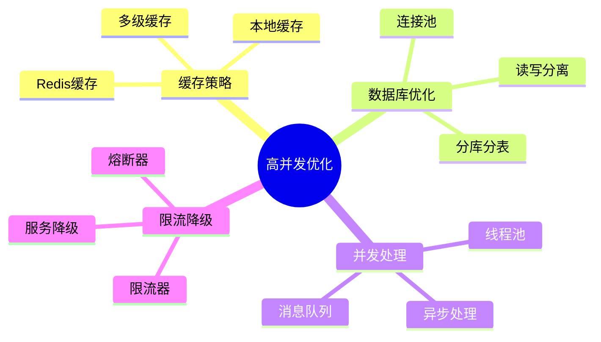

# st-highlyConcurrent

高并发场景测试项目，用于验证系统在高并发情况下的性能和稳定性。

## 项目架构

```mermaid
graph TB
    subgraph 负载层
        A[并发请求] --> B[负载均衡器]
        B --> C[服务实例1]
        B --> D[服务实例2]
        B --> E[服务实例N]
    end

    subgraph 服务层
        C --> F[线程池]
        D --> F
        E --> F
        F --> G[业务处理]
    end

    subgraph 缓存层
        G --> H[Redis缓存]
        H -->|缓存未命中| I[数据库查询]
    end

    subgraph 存储层
        I --> J[(MySQL主库)]
        J --> K[(MySQL从库)]
    end

    subgraph 技术栈
        L[Spring Boot]
        M[线程池]
        N[Redis]
        O[数据库连接池]
    end

    style A fill:#e1f5fe
    style B fill:#4fc3f7
    style F fill:#ffb74d
    style G fill:#4fc3f7
    style H fill:#f48fb1
    style J fill:#81c784
    style K fill:#81c784
    style L fill:#fff9c4
    style M fill:#fff9c4
    style N fill:#fff9c4
    style O fill:#fff9c4
```

## 并发测试流程

```mermaid
sequenceDiagram
    participant C as 并发客户端
    participant S as 服务端
    participant T as 线程池
    participant R as Redis
    participant D as 数据库

    C->>S: 高并发请求
    S->>T: 提交任务
    T->>T: 线程调度
    T->>R: 查询缓存
    alt 缓存命中
        R-->>T: 返回缓存数据
    else 缓存未命中
        T->>D: 查询数据库
        D-->>T: 返回数据
        T->>R: 写入缓存
    end
    T-->>S: 返回结果
    S-->>C: 响应请求
```

## 性能优化策略

```mermaid
mindmap
  root((高并发优化))
    缓存策略
      Redis缓存
      本地缓存
      多级缓存
    数据库优化
      连接池
      读写分离
      分库分表
    并发处理
      线程池
      异步处理
      消息队列
    限流降级
      限流器
      熔断器
      服务降级
```